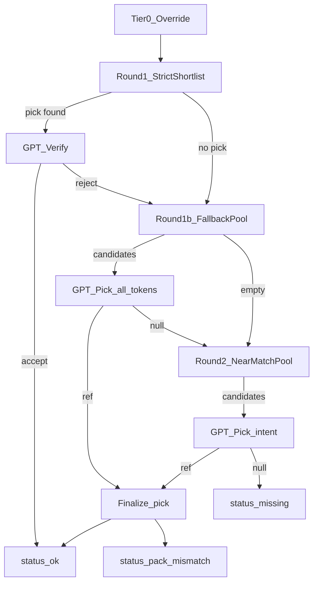

# Catalog Matching (v2)

Canonical reference for how basket lines are matched to Talabat catalog products
for price tracking. Implementation lives in
[`src/viva_tracker/match_engine.py`](../src/viva_tracker/match_engine.py),
[`src/viva_tracker/basket_matcher.py`](../src/viva_tracker/basket_matcher.py), and
[`src/viva_tracker/gpt_match_verify.py`](../src/viva_tracker/gpt_match_verify.py).

## Purpose

Each active basket line is matched, per store, against that store's saved catalog
JSON (under `catalogs/`). The match produces a row in `item_url_master` with a
product URL, pack comparison, and status.

Matching is **basket-first**: the only inputs that drive a match are

- `basket_label` — the product tokens (e.g. `White Sliced Bread Large 600g`),
- the pack parsed from that label,
- the basket `category` (drives form guards and the produce/meat grouping),
- an optional `line_role` (`own_brand` / `outside_brand`, used for the UHT milk
  lines 12-13).

The chain `mapped_name`, `brand_token`, and `generic_description` columns are
**reference only** and do not affect matching.

## Pipeline

### Tier 0 — Overrides

`config/match_overrides.json` (loaded by
[`match_overrides.py`](../src/viva_tracker/match_overrides.py)) can force a line
to a specific product slug or mark it intentionally `missing`. Overrides win over
everything else.

### Round 1 — Strict shortlist

`shortlist_rows()` in `basket_matcher.py`:

- **All** `basket_label` tokens must appear in the catalog title or URL slug.
- Packaged lines require an **exact** pack tier; loose-fresh lines
  (`produce` / `meat`, see [`match_groups.py`](../src/viva_tracker/match_groups.py))
  are pack-agnostic and picked by normalized price-per-kg.
- Row must pass `passes_line_role` and `passes_form_guard`.

The cheapest surviving row is sent to `verify_pick()`; if GPT accepts, the line is
finalized.

### Round 1b — Fallback pool

`fallback_pool_rows()`: same all-token + role + form gates, but the pack tier may
be **close** (within 8 percent). The top 10 percent of the pool by pack/price score
is sent to `pick_from_candidates()` for GPT to pick from. After GPT picks, the
engine swaps to the **cheapest intent peer** in the full fallback pool when an
equivalent cheaper SKU exists.

If Round 1 produced a shortlist pick but there is no OpenAI client, that pick is
used directly (heuristic mode).

### Round 2 — Near-match GPT intent pick

Runs only when Round 1b yields no candidates (or GPT returns `null`). This is the
stage that recovers lines that fail the all-token gate, such as
`Mixed Nuts Bar 40g` (no catalog title contains `mixed` and `nuts` and `bar`).

- **Retrieval (`near_match_pool_rows`)**: a row qualifies if it shares at least one
  **distinctive** token with the basket label (`distinctive_name_tokens`, which
  drops generic descriptors like `large` / `premium` / `fresh`). Falls back to the
  full basket token set when the label has no distinctive token.
- **Pack filter (packaged)**: candidate pack must be within **+/-12 percent** of the
  basket pack (same base unit) via `pack_match_tier(..., tolerance=0.12)` accepting
  `multipack_exact` / `exact` / `close`.
- **Loose fresh**: pack-agnostic, same per-kg rule as Round 1 (no +/-12 percent gate;
  weights are already comparable per base unit).
- **Guards**: `passes_line_role` and `passes_form_guard` run **before** GPT, so a
  soap "bar" or a juice never enters the pool for a nuts bar / fresh fruit line.
- **Pool size**: top **20** rows ranked by name similarity
  (`name_similarity_parts`) plus a small pack-tier bonus.
- **GPT role (`pick_from_candidates(..., intent_pick=True)`)**: pick by customer
  intent — same product category and same need, pack within the stated band —
  or return `null`. A minimum confidence of **0.55** is enforced; below that the
  pick is treated as `null`.
- After GPT picks, the engine scans the **full candidate pool** for packaged lines with the
  same pack tier, comparable basket-token overlap, and intent score within a tight band,
  then **swaps to the cheapest** shelf price. Loose fresh lines skip this step (Round 1
  already picks cheapest per kg/L).
- GPT's pick is re-checked with `passes_form_guard` before it is finalized.

### Finalize

`_finalize_product_pick()` sets the status and `pack_match`:

- exact / multipack-exact pack -> `status=ok`, `pack_match=exact`
- loose fresh -> `status=ok`, `pack_match=normalized`
- otherwise -> `status=pack_mismatch` with the measured tier (`close` / `different`)

## Match methods

`match_method` recorded on the `item_url_master` row:

| Method | Meaning |
|--------|---------|
| `override` | Forced by `config/match_overrides.json` |
| `heuristic` | Round 1 shortlist pick, no GPT verify (no API key) |
| `gpt` | Round 1 verified or Round 1b GPT pick (all-token) |
| `gpt_near_pick` | Round 2 near-match GPT intent pick |

## Match statuses

| Status | Meaning |
|--------|---------|
| `ok` | URL found with exact/close/normalized pack |
| `pack_mismatch` | Product matched but target pack outside the close band — normalized price still computed |
| `missing` | No suitable catalog product after all rounds |

`pack_match` values: `exact`, `close`, `normalized` (loose fresh, per-kg),
`different`, `unknown`.

For competitive pricing, `_pack_ok_for_competitive` in
[`jobs.py`](../src/viva_tracker/jobs.py) treats `exact` and `normalized` as
comparable; `close` / `different` are excluded unless `include_pack_mismatch` is set.

## Missing-match audit

[`missing_match_audit.py`](../src/viva_tracker/missing_match_audit.py) classifies
every `status=missing` row into a bucket for review
(`scripts/audit_missing_matches.py` writes CSV + Excel):

| Bucket | Meaning |
|--------|---------|
| `override_missing` | Intentional `missing` in overrides |
| `no_token_shortlist` | No catalog row contains every basket token |
| `no_pack_shortlist` | Token-compatible rows exist, none with exact pack |
| `gpt_rejected` | Round 1 shortlist pick rejected by GPT verify |
| `near_pool_empty` | Round 2 found no near-match candidates |
| `gpt_near_rejected` | Round 2 ran, GPT picked `null` / below confidence |
| `fixable_slug` | Basket shortlist finds a viable row — rematch or add override |
| `gate_reject` | Catalog hit blocked by form guards |
| `true_absence` | No plausible catalog hit / data gap |

Where possible the audit attaches the top near-match suggestion (product name +
slug) so a reviewer can add an override quickly.

## Operations

- Re-match all items after upgrading:
  `python gpt_catalog_match.py --all-stores --all-items`
- Match a single store:
  `python gpt_catalog_match.py --store-label "Store Name"`
- Refresh the missing-match audit:
  `python scripts/audit_missing_matches.py`
- OpenAI usage is logged to `aiuse/openai_usage.xlsx`. Each row records the
  operation (`match_verify`, `match_pick`, `match_pick_near`), model, line number,
  candidate count, and token cost — **not** the candidate list itself.

## Legacy / deferred cleanup

A line-level cleanup pass is intentionally deferred. Known follow-ups:

- [`catalog_match.py`](../src/viva_tracker/catalog_match.py) is dual-use: v2 relies
  on its token/normalization helpers (`_norm`, `token_hits`,
  `distinctive_name_tokens`, `name_similarity_parts`, `product_form_compatible`),
  while `best_catalog_match` / `score_catalog_item` serve the older
  `jobs.refresh_item_url_master` live-catalog path.
- `match_identity_retries()` in `match_engine.py` is a thin compatibility wrapper
  around `match_store(skip_existing=False)` and could be renamed.
