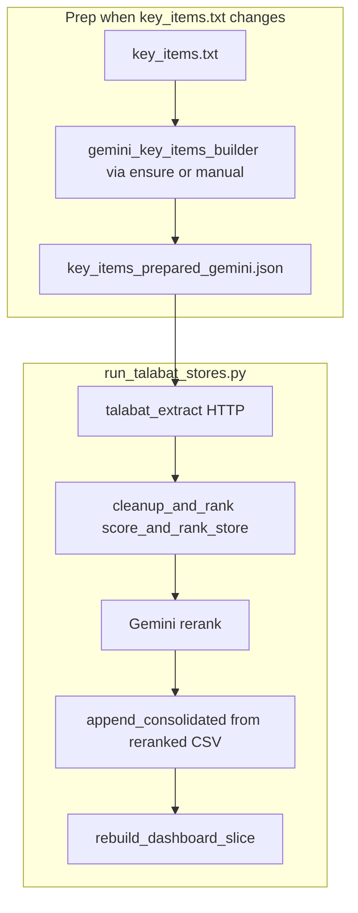

# Talabat competitive pricing pipeline — full documentation

## Purpose

Fetch grocery product listings from Talabat UAE for a fixed list of **key items** across multiple stores, score matches, optionally refine matches with **Gemini**, and produce:

- Per-store artifacts under `output/stores/`
- Append-only history: `output/consolidated_pricing.csv`
- Dashboard slice: `output/consolidated_dashboard.csv`
- Streamlit UI: `app.py` (reads consolidated CSVs + `config/bouquets.json`)

## Component map

| Piece | Path | Role |
|-------|------|------|
| Key-item text helpers | `key_item_line_parse.py` | Parse raw lines (`parse_line`), synonyms, normalization. |
| Gemini key-item prep | `gemini_key_items_builder.py` | Builds `config/key_items_prepared_gemini.json` from `config/key_items.txt`. |
| Prep gate + hash | `prepared_key_items_sync.py` | `config/.key_items_source.sha256` tracks `key_items.txt`; regenerates Gemini JSON when needed. |
| HTTP extract | `talabat_extract.py` | First-page search per line → per-store raw JSON. |
| Score / rank | `cleanup_and_rank.py` | Similarity scoring, CSV/JSON per store, optional Gemini rerank helpers. |
| Orchestrator | `run_talabat_stores.py` | All stores: extract → score → (rerank) → consolidated + dashboard. |
| Dashboard | `app.py` | Streamlit charts/tables. |

Archived reference (not part of the default flow): `archive/prepare_key_items_heuristic.py`, `archive/config/key_items_prepared.json`.

## End-to-end sequence (default: Gemini rerank **on**)

If you pass **`--no-gemini-after`**, the run uses **base** `{store}.csv` for both append and dashboard (no rerank step).

## CLI reference

### `run_talabat_stores.py`

| Flag | Default | Meaning |
|------|---------|---------|
| `--key-items` | `config/key_items_prepared_gemini.json` | Prepared key-items JSON. |
| *(no flag)* | Gemini rerank **on** | Run rerank after scoring. |
| `--no-gemini-after` | — | Skip Gemini rerank; use algorithmic matches only. |
| `--gemini-rerank-all` | off | Rerank all lines, not only low-score. |
| `--skip-key-items-prep` | — | Do not auto-run Gemini prep from `key_items.txt`. |
| `--force-key-items-prep` | — | Always regenerate prepared Gemini JSON before extract. |
| `--parallel-stores N` | 1 | Concurrent store fetches. |
| `--fast` | — | Shorter HTTP delays. |

### `gemini_key_items_builder.py`

- `--input`, `--output`, `--model`, `--dry-run`.

### `talabat_extract.py`

- `--key-items` (default: Gemini JSON), `--store-uuid`, `--out-json`, `--fast`.

## Environment variables

| Variable | Used by |
|----------|---------|
| `GOOGLE_API_KEY` or `GEMINI_API_KEY` | Gemini prep (`gemini_key_items_builder`), rerank (`run_talabat_stores` when rerank on). |
| `GEMINI_MODEL` | Optional model override. |
| `env` / `.env` | Loaded via `python-dotenv` (see `prepared_key_items_sync.load_dotenv_if_present`). |

## Data files

| File | Role |
|------|------|
| `config/key_items.txt` | Source list of key lines (category-prefixed). |
| `config/key_items_prepared_gemini.json` | LLM-cleaned `search_query` + `label` per line. |
| `config/.key_items_source.sha256` | SHA-256 of `key_items.txt` for skip logic. |
| `config/talabat_stores.json` | Store labels + UUIDs. |
| `config/bouquets.json` | Grouping for dashboard. |

## Consolidated vs dashboard

- **`consolidated_pricing.csv`**: Append-only; each run adds rows for **(extraction_date, store_name, …)**. With default rerank, rows come from **`*.reranked.csv`** for that run.
- **`consolidated_dashboard.csv`**: Rebuilt slice for the run date; `pick_store_csv` prefers **`*.reranked.csv`** when present.

## Testing

See [`flow_tests/README.md`](../README.md), [`PLAN.md`](../PLAN.md), and [`cases/CASES.md`](../cases/CASES.md). Automated tests live in [`tests/`](../../tests/).

## Operational notes

- Re-running the pipeline on the same calendar day may duplicate rows in consolidated CSVs if you use the same `extraction_date`; the dashboard rebuild replaces that date’s slice.
- Do not commit secrets; use `env` or `.env` locally (gitignored).
